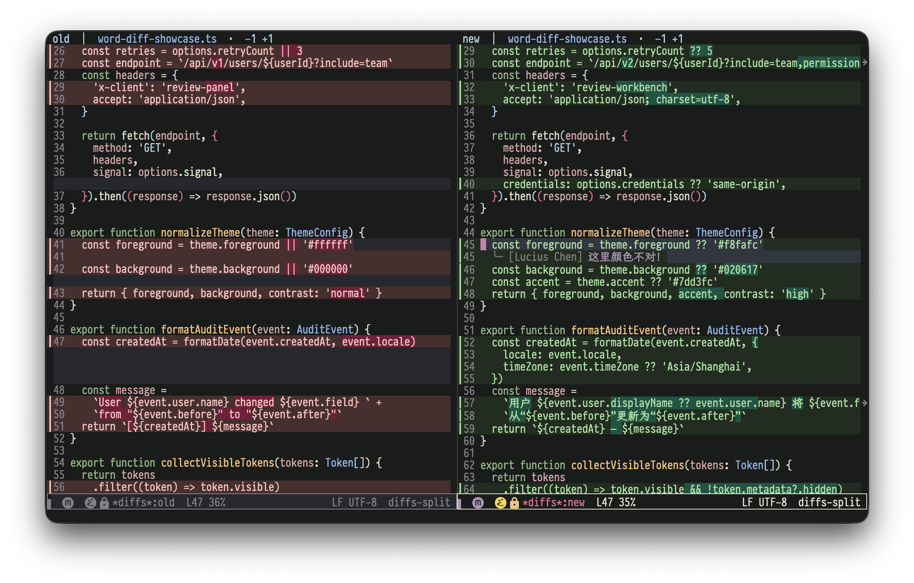

# diffs.el

Diffs.el is a native review surface for Emacs users who want [diffs.com](https://diffs.com/)-style file and project diffs without replacing `diff-mode` or leaving their existing editing workflow.

It adds aligned old/new line numbers, full-width change backgrounds, fringe bars, source syntax, within-line refinement, inline comments, accept/reject previews, and merge-conflict actions while preserving normal source navigation, search, copying, and hunk operations. Command-created reviews open side by side by default; set `diffs-default-view` to `stacked` for a unified initial layout.



Diffs.el requires Emacs 29.1 or newer. Rendering is pure Elisp; VC, Git, or Emacs's built-in diff frontend is used only to produce the input patch.

## Installation

Install the current repository directly with the built-in `package-vc` command:

```text
M-x package-vc-install RET https://github.com/LuciusChen/diffs.el RET
```

Alternatively, clone the repository, add its directory to `load-path`, and load the package:

```elisp
(add-to-list 'load-path "/path/to/diffs.el")
(require 'diffs)
```

## Why diffs.el

- No renderer subprocess and no ANSI parsing. (The commands still use VC/Git or the configured `diff-command` to produce their input.) Opening a diff costs one cheap scan (≈17 ms for 22k lines / 800 files); on large diffs even the decorations are applied lazily through jit-lock, so only what you see is rendered.
- The diff text is never modified: `diff-goto-source` (`RET`), isearch, `diff-apply-hunk`, and the rest of `diff-mode` keep working; line numbers live in `line-prefix`, so copying and searching stay clean.
- Theme-native: everything inherits from the standard `diff-*` faces.
- Revision-aware syntax highlighting: the old side is fontified from the file contents at the reference revision.
- Native within-line rendering globally pairs corresponding changed lines before applying a diffs.com-style `word-alt` token diff.

## Quick start

Run `M-x diffs-file` in a tracked file, `M-x diffs-files` to compare any two saved files, or `M-x diffs-project` anywhere inside a project. The first view is split; `s` switches layouts and `q` returns to the previous window configuration.

Opening a `.diff` or `.patch` file enters `diffs-mode` directly, so no separate patch-view command is needed. File-backed patch buffers start with the native stacked owner because major-mode selection happens before Emacs displays the buffer; press `s` for the same split renderer. An externally generated buffer that already uses `diff-mode` can opt into the same renderer with `M-x diffs-minor-mode`.

### Entry points

| Entry point | Kind | Description |
|---|---|---|
| `diffs-file` | Command | Current file vs the reference revision, including staged and unsaved changes when diff-hl is available |
| `diffs-files` | Command | Any two saved files, with the first on the old/left side and the second on the new/right side |
| `diffs-project` | Command | Saved project working tree vs the reference revision |
| `diffs-commit` | Command | Show a commit (Git) |
| `diffs-commit-at-line` | Command | Show the commit that last touched the current line |
| `diffs-items` | Elisp API | Show unchanged source-file items and patch items in one review |
| `diffs-mode` | Major mode | Open `.diff` and `.patch` files as native read-only reviews |
| `diffs-conflict-mode` | Minor mode | Resolve merge markers in place with Current, Incoming, Both, and Reset |
| `diffs-minor-mode` | Integration | Use the renderer in an externally owned diff-mode buffer |
| `diffs-diff-hl-mode` | Command | Render diff-hl's current inline or posframe hunk with diffs.el |

### Compare two files

`M-x diffs-files` first prompts for the old/left file and then the new/right file. The files may have different names and live in different directories or outside version control. The command uses Emacs's configured `diff-command` to compare their saved contents, then opens the same stacked or split review used by every other diffs.el entry. Long header paths elide middle directories while retaining their identifying suffixes; source coordinates always keep the complete paths.

Source navigation remains side-specific: `RET` or `M-RET` on the left visits the first file, while the same commands on the right visit the second. Comments from either side stay in one comparison section: left comments carry old ranges, while the second file is the canonical file path exposed to review agents. `e` loads unchanged context from both files, `g` rereads the same paths, and `q` restores the entry layout and position. Review decisions are previews until explicitly applied with `C-c C-c`; application targets only the second file and never saves or stages it.

### Review keys

| Key | Action |
|---|---|
| `n` / `p` | Next / previous hunk |
| `N` / `P` | Next / previous file in stacked view |
| `RET` | Visit the source line |
| `M-RET` | Visit the exact source token |
| `S-mouse-1` | Run token click hooks, or visit the exact source token |
| `i` | Toggle the changed-file index |
| `e` | Reveal more unchanged context |
| `TAB` | Fold or unfold a hunk in stacked view |
| `v` / `x` | Select / clear a stable review range |
| `a` | Add a comment to the selected range |
| `[` / `]` | Previous / next comment |
| `A` / `R` / `U` | Accept / reject / reset a change block |
| `C-c C-c` | Apply reviewed decisions without saving or staging |
| `s` | Enter split view or return to stacked view |
| `g` | Refresh the review transactionally |
| `q` | Quit the complete review; in split view both columns close |

A review is an explicit snapshot. Use `g` whenever source-buffer, formatter, Git, or Agent changes should appear in that snapshot. Refresh preserves the current side and source-row identity; a failure leaves the existing review and window layout untouched.

## Accept and reject changes

Press `A` on a changed line to keep its complete contiguous change block, or `R` to restore the old version in the review preview. A prefix argument (`C-u A` or `C-u R`) resolves every change block in the current hunk. This matches diffs.com's model: resolved additions or deletions become context, later result line numbers are adjusted, and the original patch remains unchanged.

The preview is shared by stacked and split layouts. In stacked view the discarded side is hidden beneath a decision label. In split view both columns collapse to the chosen result while retaining stable block identity. Press `U` on that label or result block to reset one decision; `C-u U` resets the complete review. Reset changes only the preview decision: if a result was already applied to a source buffer, its physical line shifts remain tracked so later `RET` navigation and applications still address the live worktree correctly.

Decisions do not modify files by themselves. After reviewing several blocks, press `C-c C-c` to validate and apply the combined result. Accepted blocks already match the new-side source. Rejected blocks replace the corresponding new-side text with the old text. Changed source buffers remain unsaved and nothing is staged, so normal Emacs undo and a final source review remain available.

## Merge conflicts

Open a source file containing Git conflict markers and run `M-x diffs-conflict-mode`. The mode itself is the complete entry: it validates every block, installs the presentation, and moves to the first conflict; invoking it again disables only the presentation. The existing source buffer remains in its language major mode, so syntax highlighting, Eldoc, Xref, LSP state, file identity, and unrelated unsaved edits stay in place. Diffs.el adds a stacked action row above each conflict and theme-native backgrounds for its Current, optional Base, and Incoming sections. Current and Incoming marker rows use a stronger background than their code blocks, visually join those blocks, carry explicit section labels, and use matching fringe bars without changing the underlying Git marker text.

Actions use the `C-c C-d` prefix:

| Key | Action |
|---|---|
| `C-c C-d c` | Keep Current |
| `C-c C-d i` | Keep Incoming |
| `C-c C-d b` | Keep Current followed by Incoming |
| `C-c C-d u` | Restore the complete original marker block |
| `C-c C-d n` / `C-c C-d p` | Visit the next / previous conflict |
| `C-c C-d q` | Remove the presentation while retaining source edits |

The unresolved action row provides Accept current change, Accept incoming change, and Accept both with mouse-1. After a selection, Reset appears alongside the alternative choices. Every selection immediately replaces that block in the real buffer as one ordinary undoable edit. It never saves the file, stages a change, or runs Git. The resulting file is therefore the preview, and Reset remains available after every conflict has been resolved.

Two-way and diff3 markers are supported. For diff3 input, Base remains visible while unresolved but is not included in any result; Both is exactly Current followed by Incoming. Marker widths greater than seven are accepted. Malformed or nested conflicts are rejected before the mode is enabled, and a block edited by another command must be undone before diffs.el will replace it. Standard blocks use smerge's public matcher and Current/Incoming operations. Diffs.el keeps the stronger visual layer, strict preflight, diff3 Both-without-Base behavior, extended marker fallback, and persistent Reset state. Existing `smerge-mode` state is left enabled and its `C-c ^` bindings are not changed.

## Review selection and comments

Press `v` on a changed line to select that old- or new-side source line. For a range, activate a normal Emacs region (`C-SPC`), extend it over changed lines on the same file and side, then press `v`. The stored selection is a one-based file/side/line range rather than a buffer position, so it survives stacked/split switches and context rebuilds.

Press `a` to add a summary and optional rationale. Comments render below their target line; in split view the peer column receives an invisible equal-height spacer, so later code stays aligned. Use `[` and `]` to navigate comments, `x` to clear only the selection, and `M-x diffs-review-remove-annotation` or `M-x diffs-review-clear-annotations` to remove comments.

Comments are buffer-local state owned by the live review session. Quitting the complete review with `q` ends that session and discards comments that were not explicitly persisted. `M-x diffs-review-export` writes a Hunk-compatible version-1 sidecar using `oldRange`/`newRange`; `M-x diffs-review-import` restores it only after validating every known field and old/new target against the current diff. Unknown fields are ignored for compatibility with newer producers, and an annotation may carry both old and new ranges. An invalid import or display failure leaves existing comments intact.

### Live Agent sessions

Code agents can read human comments and write their own directly against the live owner buffer. No sidecar, cache, or temporary export is involved. Start the normal Emacs server with `M-x server-start`, then run:

```sh
diffs session list --json
diffs session review --repo . --include-notes --json
diffs session comment list --repo . --type user --json
```

Each live review has a stable `diffs-session:…` id for the lifetime of its owner buffer. `--repo` selects the matching repository when there is only one session; use `--session ID` when the same repository has multiple reviews. Review snapshots also include the user's pending accept/reject decisions per file.

Agents write one atomic stdin batch:

```sh
printf '%s\n' \
  '{"comments":[{"filePath":"src/example.el","newLine":42,"summary":"This branch drops the error value.","author":"codex"}]}' \
  | diffs session comment apply --repo . --stdin --focus --json
```

Each comment needs `filePath`, `summary`, and exactly one target: `oldLine`, `newLine`, `oldRange`, `newRange`, `hunk`, or `hunkNumber`. Optional `rationale` and `author` strings add context. An invalid file, target, field, or comment rejects the entire batch. The CLI also provides `comment list`, `comment rm`, and guarded `comment clear` commands; run `diffs --help` for their exact forms.

Run `M-x diffs-review-install-agent-tools` once to copy the bundled [CLI](bin/diffs) to `~/.local/bin/diffs` and the bundled [Codex skill](skills/diffs-review/SKILL.md) to `~/.agents/skills/diffs-review`. Ensure `~/.local/bin` is on `PATH`. The installed files are durable copies rather than links into a straight/MELPA build directory, so package upgrades cannot leave them dangling. Installation preflights every destination and rolls back all targets if a later write fails. Use a prefix argument once to replace links from an older installation. Set the `EMACS` environment variable when the CLI should launch a particular Emacs executable.

After installation, ask Codex CLI or Codex App to “read my live Emacs diff comments.” The skill uses `diffs session`, never screen scraping or temporary files. The CLI directly contacts the existing Emacs Unix socket, so a restricted agent sandbox may ask for one-time permission to access that socket.

### Emacs Lisp review API

Emacs owns the live data. From a stacked or split review, `(diffs-review-annotations)` returns a copy of the structured annotation plists without reading rendered text. Session JSON functions resolve the same live owner buffer used by the CLI; they do not read a sidecar, cache, or temporary file.

```elisp
;; Structured Elisp data from the current stacked or split review.
(diffs-review-annotations)

;; JSON containing human comments from the one live review for a repository.
(diffs-review-comments-json "/path/to/repository/" "user")
```

`SELECTOR` may be a live `diffs-session:…` id, a repository directory, or a working directory. A `nil` selector prefers the current review and otherwise succeeds only when exactly one live review exists. `TYPE` accepts `all`, `user`, or `agent`, as either a string or symbol. `FILE` is an optional current diff path. JSON-returning functions produce compact JSON strings and signal `user-error` rather than choosing silently when a selector is missing or ambiguous.

Annotation plists use `:id`, `:file`, inclusive one-based `:old-range`/`:new-range`, `:summary`, and optional `:rationale`, `:author`, `:source`, `:tags`, `:confidence`, `:created-at`, and `:updated-at` fields. JSON comment objects expose the corresponding camel-case fields plus `filePath`; absent optional values are omitted.

| Function | Result or effect |
|---|---|
| `(diffs-review-selected-range)` | Return a copy of the current `:file`, `:side`, `:start`, and `:end` selection plist, or `nil` |
| `(diffs-review-annotations)` | Return copies of all annotation plists in the current stacked or split review |
| `(diffs-review-sessions-json)` | Describe every live review session |
| `(diffs-review-json SELECTOR INCLUDE-PATCH INCLUDE-NOTES)` | Describe files, hunks, decisions, selection, and optionally raw patches and annotations in one live review |
| `(diffs-review-comments-json SELECTOR TYPE FILE)` | Return filtered live comments |
| `(diffs-review-apply-comments-json JSON SELECTOR FOCUS)` | Validate and atomically add one non-empty Agent comment batch; optionally navigate to its first comment |
| `(diffs-review-remove-comment-json SELECTOR ID)` | Remove one session-local comment id |
| `(diffs-review-clear-comments-json SELECTOR FILE TYPE)` | Remove matching live comments and return their ids |
| `(diffs-review-sidecar-json)` | Serialize annotations from the current review as Hunk-compatible version-1 JSON |
| `(diffs-review-write-json FILE SELECTOR INCLUDE-PATCH INCLUDE-NOTES)` | Explicitly write a live review snapshot to `FILE` |
| `(diffs-review-apply-comments-file FILE SELECTOR FOCUS)` | Explicitly read and atomically apply an Agent comment batch from `FILE` |

## Expandable context

Collapsed hunk separators report how many unchanged lines they hide. On a separator or anywhere in its hunk, press `e` repeatedly to reveal `diffs-context-step` more lines. Expansion is one-way within a review; once every hidden line is visible, the separator disappears. `TAB` remains available for Emacs's separate hunk/outline folding. The same `e` command works directly in the side-by-side view, where both columns rebuild together.

Expanded lines are display overlays backed by the complete old and new file contents; the underlying patch is unchanged, so applying hunks, searching, and copying retain normal `diff-mode` behavior. Expanded lines appear immediately from raw source. Source-mode fontification runs from an idle queue and publishes faces afterward; rendered line vectors are shared through a bounded cache keyed by repository, file, side, revision or worktree content, language mode, and theme generation. Theme changes invalidate rendered faces without discarding review-owned raw source.

## Changed-file index and sticky context

The header line stays pinned to the file and hunk at the top of the window.  It shows the current file position (`[3/42]`), per-file addition/deletion counts, hunk line starts, and the hunk's function context when available.

Press `i` to open a left side window containing only files present in the diff—not the complete repository tree.  Each entry includes addition/deletion counts and follows the current file while the diff scrolls.  In the index, `n`/`p` preview adjacent files without moving focus, `RET` or mouse-1 visits a file, and `i`/`q` hides the index. The index remains available with the side-by-side view.

## Side-by-side view

The default view splits the frame into two synchronized windows — old on the left, new on the right — with row-perfect alignment (dimmed filler bands pad insertions and deletions), per-side line numbers, and the same native refinement and syntax faces as the unified view. Theme-native added/removed backgrounds cover the line-number gutter and extend to the right edge.  `n`/`p` move by hunk in both windows, `RET` visits the source, `s` returns to the unified view, and `q` closes both columns and quits the complete diff view.

Long lines are truncated by default and support horizontal scrolling. Horizontal offsets, paired cursor rows, and display columns stay synchronized; `C-a` and `C-e` move both sides to their respective line beginnings or ends. Set `diffs-split-wrap-lines` to non-nil to wrap them into aligned physical rows so the two sides never drift apart.

Very large diffs bulk-insert complete old/new text, so normal isearch, copying, source navigation, and scrollbar semantics work immediately. Expensive visual work—line backgrounds, gutters, fringe bars, source syntax, and within-line emphasis—is materialized only for the viewport plus `diffs-split-overscan`, and both columns are updated together while scrolling.  Completed rows and the rendered pair are cached, so returning to a split with the same width is effectively immediate.

## Within-line changes

Consecutive removed and added lines are globally aligned by normalized edit distance before their contents are compared.  This prevents a single inserted row from shifting every later comparison in the change block.  The default `word-alt` renderer follows diffs.com's visual grouping rule for tiny unchanged separators; exact `word`, Unicode-character `char`, and disabled `none` modes are also available. The `word-alt` grouping follows the complete two-sided edit sequence, including one-sided insertions between shared separators. Unicode whitespace is handled consistently by the show/ignore option. Unified and side-by-side views consume the same cached changed ranges.

Lines over 1,000 characters skip within-line comparison by default, and change blocks over 64 lines per side use bounded ordinal fallback. Both limits are configurable.

## Token coordinates and language tools

`diffs-token-at-point` and `diffs-token-at-position` expose the source token under a stacked or split position without parsing decorated display text. The returned plist includes repository-relative and absolute file names, old/new side, revision, one-based line, zero-based character column, end-exclusive token columns, token text, and the owning review buffer. Wrapped split rows retain their logical source columns.

`M-RET` resolves that token through `diffs-token-source-position` and visits the exact character. New-side worktree tokens reuse an existing visiting source buffer, so its ordinary Eldoc, Xref, Eglot, or lsp-mode backends remain authoritative. Old-side and commit tokens use safe read-only historical buffers with file-local variables, local eval, and mode hooks disabled; diffs.el does not pretend those buffers are live LSP documents. `M-.` uses the same source-buffer Xref backend, and `diffs-eldoc-function` delegates when Eldoc is active in the review.

Three public abnormal hooks provide integration points:

| Hook | Contract |
|---|---|
| `diffs-token-source-functions` | Receive a token plist; the first non-nil `(BUFFER . POSITION)` overrides source resolution |
| `diffs-token-hover-functions` | Receive a token plist; the first non-nil documentation result precedes source-buffer Eldoc |
| `diffs-token-click-functions` | Receive a token plist and input event when `S-mouse-1` is used |

Whitespace is not interactive by default. Set `diffs-token-interactions-on-whitespace` to non-nil when an integration needs whitespace tokens.

## Mixed items and layout functions

`diffs-items` accepts unchanged source files and patches in one ordered owner model. File items are searchable, indexed, syntax-highlighted, navigable, and duplicated as unchanged rows in split view; diff items retain normal change semantics. Stable `:id` and `:version` values are optional but recommended when a caller refreshes the same review:

```elisp
(diffs-items
 (list
  (list :type 'file
        :id "guide"
        :version "worktree-17"
        :file "docs/guide.el"
        :content guide-source)
  (list :type 'diff
        :id "implementation"
        :patch patch-text))
 (list :directory project-root
       :backend 'Git
       :revision "HEAD"))
```

File items use a repository-relative `:file` and string `:content`. Diff items use string `:patch`. Options accept `:directory`, `:buffer-name`, `:backend`, `:revision`, and `:target-revision`.

File headers, line gutters, and hunk separators have one public presentation function each. Every function receives a copied context plist and returns a string or nil; returning nil suppresses that element. The same functions receive `:view` as `stacked` or `split`, so one configuration covers both layouts. Gutter functions run on materialized rows and should remain pure and fast.

| Option | Default function |
|---|---|
| `diffs-file-header-function` | `diffs-default-file-header` |
| `diffs-gutter-function` | `diffs-default-gutter` |
| `diffs-hunk-separator-function` | `diffs-default-hunk-separator` |

## Configuration

All options belong to the `diffs` customization group.

### Layout and presentation

| Option | Default | Purpose |
|---|---:|---|
| `diffs-default-view` | `split` | `split` or `stacked` layout for reviews and diff-hl hunk previews |
| `diffs-fullscreen` | `t` | Let a review take over the frame until `q` |
| `diffs-split-wrap-lines` | `nil` | Wrap long split rows with aligned fillers |
| `diffs-line-numbers` | `t` | Show old and new line-number columns |
| `diffs-hide-markers` | `t` | Hide leading unified-diff markers |
| `diffs-prettify-headers` | `t` | Replace raw file/hunk headers with compact headers |
| `diffs-fringe-bars` | `t` | Show theme-native added/removed fringe bars |
| `diffs-fringe-bar-width` | `2` | Fringe-bar width in pixels, clamped to 1–8 |
| `diffs-split-full-width-backgrounds` | `t` | Extend split change backgrounds across each row |
| `diffs-index-width` | `36` | Changed-file index width in columns |
| `diffs-buffer-name` | `"*diffs*"` | First-party review buffer name |
| `diffs-file-header-function` | `diffs-default-file-header` | Render file/source item headers in both layouts |
| `diffs-gutter-function` | `diffs-default-gutter` | Render stacked and split gutters |
| `diffs-hunk-separator-function` | `diffs-default-hunk-separator` | Render collapsed hunk/context separators |

### Context and within-line refinement

| Option | Default | Purpose |
|---|---:|---|
| `diffs-context-step` | `10` | Unchanged lines revealed by each `e` |
| `diffs-line-diff-type` | `word-alt` | `word-alt`, exact `word`, Unicode `char`, or `none` |
| `diffs-refine-whitespace` | `show` | Show or ignore whitespace-only token changes |
| `diffs-max-line-diff-length` | `1000` | Longest line eligible for token comparison; zero disables the limit |
| `diffs-line-pair-threshold` | `0.6` | Maximum normalized edit distance for corresponding lines |
| `diffs-line-pair-limit` | `64` | Largest change block per side using global alignment |

### Large-review rendering

| Option | Default | Purpose |
|---|---:|---|
| `diffs-lazy-threshold` | `10000` | Start applying stacked decorations through jit-lock |
| `diffs-split-overscan` | `60` | Extra split rows prepared above and below the viewport |
| `diffs-render-cache-limit` | `64` | Shared syntax-rendered source revisions retained globally |
| `diffs-syntax-idle-delay` | `0.05` | Idle delay before one queued source revision is fontified |

The Agent installer destinations are controlled by `diffs-review-cli-install-path`, `diffs-review-skill-install-directory`, and `diffs-review-assets-directory`.

On an M-series Mac running Emacs 32, the included synthetic benchmark (800 files, 22,000 lines, 536 KB) measures about 17 ms for scanning, 275 ms for the first side-by-side render, 20 ms to materialize a first deep viewport, and 0.7 ms for a cached toggle.  This includes line numbers, fringe bars, source syntax, and native corresponding-line/word refinement with the default non-wrapping split.  The v0.7 first-split baseline was about 332 ms.  The same fixture also exercises the public split-view `A` and `R` decision path: those rebuilds take about 350 ms and 400 ms respectively, down from about 943 ms and 1,016 ms after deferring hidden stacked-overlay projection until stacked is requested. Run it on your machine with:

```sh
make benchmark
```

## Integrations

- **diff-hl**: `diff-hl-reference-revision` and its public project cache are respected, so `diff-hl-set-reference-rev-in-project` gives both file and project commands a branch-point ("PR") view. Saved and unsaved file views use the same base; a nil reference means the last revision rather than the Git index. The project command intentionally reads the saved working tree and does not combine unrelated unsaved buffers.

  Diffs.el can render diff-hl's compact current-hunk views through the standard `diff-hl-show-hunk-function` extension point. Enable diff-hl's mouse mode and the optional integration mode:

  ```elisp
  (global-diff-hl-show-hunk-mouse-mode 1)
  (diffs-diff-hl-mode 1)
  ```

  Mouse-1 on a diff-hl-enabled margin or fringe and `M-x diff-hl-show-hunk` now show only the selected hunk, using diffs.el's line numbers, marker-free rows, source syntax, line pairing, and word refinement. Diffs.el uses the complete patch that diff-hl already generated to compute those results, but decorates only the narrowed current hunk and does not open a full-file review. The raw patch remains intact, so diff-hl's quit, previous/next, copy, revert, and stage actions continue to work.

  Content layout follows `diffs-default-view`: the default `split` renders the current hunk as aligned old/new columns inside the inline popup or posframe, while `stacked` uses the unified presentation. This is independent of `diffs-diff-hl-display-function`, which decides where that content is displayed.

  The integration mode changes no mouse bindings and does not enable diff-hl or its mouse mode. By default it preserves the inline, posframe, or other public backend that it replaces; disabling it restores that backend. Set `diffs-diff-hl-display-function` to choose placement explicitly:

  ```elisp
  (setq diffs-diff-hl-display-function
        #'diff-hl-show-hunk-posframe)
  ```

  Declarative configurations can install the adapter directly instead. With no explicit display function this form uses the inline backend:

  ```elisp
  (setq diff-hl-show-hunk-function #'diffs-diff-hl-show-hunk)
  ```

  Use `diffs-file` when you want the complete stacked or split review; the compact diff-hl entry intentionally remains a single-hunk view.

- **blame / blame-reveal**: `diffs-commit-at-line` shows the commit behind the line you are on.

## Format handling

Metadata-only Git changes such as renames and mode changes remain visible instead of being reported as an empty diff.  Quoted Git paths are decoded for source navigation.  Commit views use a first-parent two-way diff, including for merge commits, since the UI has an old and a new side.  A combined diff supplied directly remains visible as raw metadata instead of being hidden or rejected.

## Development

Run the ERT suite with:

```sh
make test
```
